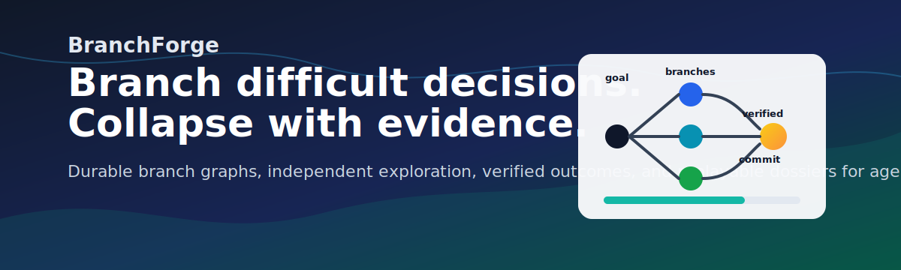
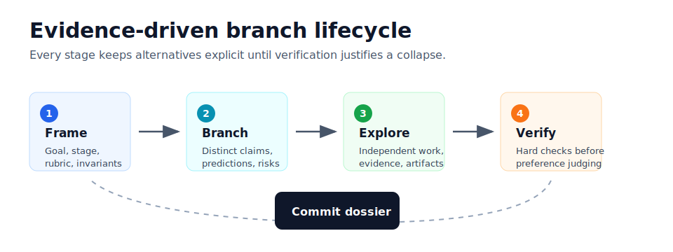

# BranchForge



BranchForge is an adaptive deliberation system for difficult decisions. It helps an agent explore materially different hypotheses, preserve branch evidence, verify claims, and collapse the search into an auditable decision.

> **Status:** experimental v0.1. Agent-native orchestration, deterministic MCP tools, durable branch storage, portable dossiers, and Codex/Claude skill suites are implemented. Isolated software worktrees and objective evaluator plugins remain planned.

## Why

Single-path agent reasoning can anchor too early, inherit bad assumptions, and forget rejected options. BranchForge adds a lightweight control plane for the moments where alternatives actually matter:

- branch only at consequential uncertainty;
- explore competing hypotheses independently;
- verify hard constraints before preference judging;
- preserve failed and rejected paths;
- commit a replayable decision record.

## How It Works



1. Frame a bounded stage with invariants and a rubric.
2. Add two to four materially different hypotheses.
3. Explore branches independently.
4. Record claims, evidence, findings, risks, and artifacts.
5. Verify candidates and commit one stage winner.
6. Render durable dossiers under `.branchforge/runs/<run_id>/`.

## Quick Start

Requirements:

- Python 3.11+
- Git
- Codex, Claude Code, Claude Desktop, or another MCP-capable host

```bash
git clone https://github.com/elijahbutler/branchforge.git
cd branchforge
./scripts/install-agent.sh --all --force
```

Restart the agent host after installation.

Codex:

```text
$branchforge design an auditable event-processing product. Begin with
research, compare product concepts, then explore competing architectures.
```

Claude Code:

```text
/branchforge design an auditable event-processing product. Begin with
research, compare product concepts, then explore competing architectures.
```

## CLI

```bash
branchforge doctor --host local
branchforge run "Choose an event-processing architecture" --provider mock
branchforge status
branchforge tree
branchforge dossier
```

`doctor` runs non-mutating install diagnostics. `status` reports blockers and next actions for a run. `tree` and `dossier` inspect durable output.

## Repository Layout

```text
branchforge/
├── docs/                    # Focused user and maintainer docs
├── plugins/branchforge/     # Codex plugin manifest and MCP config
├── skills/                  # BranchForge skill suite
├── src/branchforge/         # Python package, CLI, MCP server, repository
├── scripts/                 # Local installers
├── tests/
└── PROJECT_PLAN.md
```

## Docs

- [Installation](docs/installation.md)
- [Usage](docs/usage.md)
- [Architecture](docs/architecture.md)
- [Development](docs/development.md)
- [Project plan](PROJECT_PLAN.md)

## Development

Run the test suite directly from the checkout:

```bash
PYTHONPATH=src python3 -m unittest discover -s tests -v
```

## License

MIT
