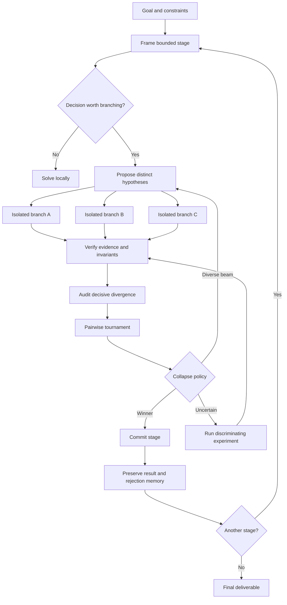
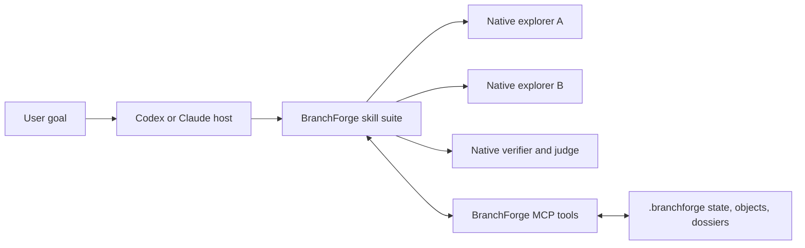

# BranchForge

BranchForge is an adaptive deliberation system for difficult decisions. It explores a bounded set of materially different hypotheses, develops them independently, verifies their claims, audits their decisive disagreements, and collapses the search into a committed stage result.

The repository provides two complementary modes:

1. **Agent-native mode (recommended)** — Codex or Claude performs all reasoning and native subagent work. BranchForge skills define the workflow, while MCP tools persist the branch graph, evidence, artifacts, and dossiers.
2. **Headless provider mode** — the Python kernel calls configured model APIs directly for automation outside an agent host.

BranchForge is inspired by beam search, Monte Carlo tree search, evolutionary selection, reasoning-tree auditing, actor–critic systems, and tournament-of-ideas architectures. The “quantum” analogy is conceptual: competing computational trajectories coexist until evidence justifies a collapse. BranchForge is not a quantum computing implementation.

> **Project status:** experimental v0.1. Agent-native orchestration, deterministic MCP tools, durable branch storage, and the portable skill suite are implemented. Isolated software worktrees and objective evaluator plugins remain planned.

## Why BranchForge?

Strong models can reason deeply, but a single trajectory has predictable weaknesses:

- it anchors on its first plausible plan;
- later reasoning inherits early assumptions;
- self-critique often shares the same blind spots;
- an eloquent answer can appear stronger than a better-tested alternative;
- long-running tasks forget rejected approaches and repeat mistakes;
- unrestricted multi-agent spawning creates cost without meaningful diversity.

BranchForge addresses those weaknesses by branching only at consequential uncertainties, preserving independent exploration, and making evidence—not consensus—the basis of convergence.

The central principle is:

> Spend parallel computation only where uncertainty and consequence justify competing exploration. Collapse using evidence, while preserving enough diversity and memory to recover from a mistaken judgment.

## How it works



### Branch

A branch is a falsifiable hypothesis—not a random thought or slight implementation variation. Every branch declares:

- its claim and strategy;
- its material difference from other branches;
- predicted observable outcomes;
- evidence that would falsify it;
- cost, risk, and resource needs.

### Compete

Explorers work independently to reduce imitation and premature convergence. Each returns evidence, risks, artifacts, and calibrated uncertainty. Failed branches remain useful because their failures reshape later search.

### Verify

Hard invariants are checked before subjective judging. Tests, benchmarks, direct artifact inspection, primary sources, and deterministic validation outrank model confidence.

### Collapse

Candidates are compared at their decisive disagreements. The system may commit a winner, retain a diverse beam, synthesize compatible components, or request another discriminating experiment. A forced winner is not required when evidence is insufficient.

## Repository layout

```text
branchforge/
├── .claude-plugin/          # Claude marketplace and plugin manifests
├── .agents/plugins/         # Codex marketplace manifest
├── plugins/branchforge/     # Codex plugin manifest and MCP config
├── skills/
│   ├── branchforge/         # Public agent-native entrypoint
│   ├── branchforge-orchestrator/
│   ├── branchforge-research/
│   ├── branchforge-ideation/
│   ├── branchforge-software/
│   ├── branchforge-evaluate/
│   ├── branchforge-report/
│   └── branching-deliberation/ # Instruction-only fallback
├── src/branchforge/
│   ├── cli.py
│   ├── mcp_server.py
│   ├── models.py
│   ├── native.py
│   ├── orchestrator.py
│   ├── policy.py
│   ├── providers.py
│   ├── repository.py
│   └── store.py
├── scripts/install-agent.sh
├── scripts/install-skill.sh
├── tests/
└── PROJECT_PLAN.md
```

The host model thinks; BranchForge stores, validates lifecycle transitions, and renders evidence. The MCP server never calls an LLM.

## Agent-native quick start

Requirements:

- Python 3.11+
- Git
- Codex, Claude Code, Claude Desktop, or a combination

Clone the repository:

```bash
git clone https://github.com/elijahbutler/branchforge.git
cd branchforge
```

Install for both hosts:

```bash
./scripts/install-agent.sh --all --force
```

Or install for one:

```bash
./scripts/install-agent.sh --codex --force
./scripts/install-agent.sh --claude --force
```

`--claude` installs the skill suite and MCP server for Claude Code CLI. It also builds a separate Desktop-safe runtime under Claude's Application Support directory and registers that endpoint without replacing other Desktop servers. This separation is required because macOS may deny Claude Desktop access to virtual environments inside `Documents`. A backup is written beside the Desktop configuration before it is changed.

The installer:

1. Creates `.venv` in the checkout.
2. Installs BranchForge with the MCP dependency.
3. Installs all agent-native phase skills.
4. Registers the MCP server using the absolute `.venv/bin/branchforge` path.

Restart the agent host or open a new task after installation.

### Verify installation

Codex:

```bash
codex mcp get branchforge
```

Claude Code:

```bash
claude mcp get branchforge
```

Claude Desktop on macOS:

```bash
python3 - <<'PY'
import json
from pathlib import Path
p = Path.home() / "Library/Application Support/Claude/claude_desktop_config.json"
print(json.loads(p.read_text())["mcpServers"]["branchforge"])
PY
```

The configured command should end with:

```text
.venv/bin/branchforge mcp
```

### Invoke natively

Codex:

```text
$branchforge develop an auditable event-processing product. Begin with
research, compare product concepts, then explore competing software
architectures. Preserve every branch and ask before consequential actions.
```

Claude Code:

```text
/branchforge develop an auditable event-processing product. Begin with
research, compare product concepts, then explore competing software
architectures. Preserve every branch and ask before consequential actions.
```

The active Codex or Claude model performs reasoning and spawns native subagents. No OpenAI or Anthropic API key is required for agent-native mode.

### Claude Desktop surfaces

Claude Desktop exposes different capabilities depending on where the conversation runs:

| Desktop surface | BranchForge availability |
|---|---|
| **Code tab, Local session** | `/branchforge` skill plus all MCP tools |
| **Code tab, Remote session** | Local skills/plugins and local MCP servers are unavailable |
| **Regular Chat or Cowork** | BranchForge MCP tools and its `branchforge` MCP prompt; Claude Code slash-skills are not supported in this surface |

After installation, completely quit Claude Desktop with `Cmd+Q` and reopen it. In a regular chat, click the `+` button and open **Connectors** to confirm BranchForge is connected. In the Code tab, select **Local** before starting a session, then type `/branchforge` or choose it under `+` → **Slash commands**.

### Claude troubleshooting

Start a new Claude Code session after installation; an already-running session may not discover newly installed MCP tools or top-level skill directories.

Check the server directly:

```bash
claude mcp get branchforge
```

It must report `Status: ✔ Connected`. If it reports `Failed to connect`, update the checkout and rerun the installer:

```bash
git pull
./scripts/install-agent.sh --claude --force
```

Then check for duplicate definitions:

```bash
claude mcp list
```

There should be no `Conflicting scopes` warning for `branchforge`. Claude Code uses the checkout’s absolute `.venv/bin/branchforge mcp` command. Claude Desktop uses its separate runtime under `~/Library/Application Support/Claude/branchforge-runtime/` to avoid macOS privacy denials.

## Manual agent-native installation

Use these steps if you do not want the installer to change agent configuration.

```bash
python3 -m venv .venv
source .venv/bin/activate
python -m pip install --upgrade --force-reinstall ".[mcp]"
```

Install the complete skill suite:

```bash
./scripts/install-skill.sh --codex --force
./scripts/install-skill.sh --claude --force
```

Register Codex:

```bash
codex mcp remove branchforge 2>/dev/null || true
codex mcp add branchforge -- "$(pwd)/.venv/bin/branchforge" mcp
```

Register Claude Code:

```bash
claude mcp remove branchforge -s user 2>/dev/null || true
claude mcp add -s user branchforge -- "$(pwd)/.venv/bin/branchforge" mcp
```

## Plugin installation

The repository also contains Claude and Codex plugin manifests. The Python MCP backend must be available on `PATH` when installing through a marketplace. For local testing, the installer above is more predictable.

### Claude Code marketplace

```bash
pipx install 'branchforge[mcp] @ git+https://github.com/elijahbutler/branchforge.git'
claude plugin marketplace add elijahbutler/branchforge
claude plugin install branchforge@branchforge
```

Then restart Claude Code and invoke `/branchforge:branchforge`. Claude namespaces plugin skills; the one-command installer above installs the same entrypoint as a personal skill named `/branchforge`.

### Codex marketplace

```bash
pipx install 'branchforge[mcp] @ git+https://github.com/elijahbutler/branchforge.git'
codex plugin marketplace add elijahbutler/branchforge
codex plugin add branchforge@personal
```

Then start a new Codex task and invoke `$branchforge`.

## Skill-only fallback

If MCP cannot be installed, `branching-deliberation` remains an instruction-only fallback. It does not provide the same durable tool guarantees.

Install only the skills:

```bash
./scripts/install-skill.sh --all --force
```

Fallback invocation:

```text
$branching-deliberation explore competing architectures for this system.
```

## Using the skill effectively

The skill is appropriate when:

- several materially different architectures are plausible;
- a bug has competing causal explanations;
- research hypotheses need independent investigation;
- an implementation choice is expensive to reverse;
- a plan benefits from adversarial verification;
- optimization requires competing experiments;
- the user explicitly asks for deep branching, debate, or parallel subagents.

It should not activate for:

- routine edits;
- obvious mechanical changes;
- low-impact and easily reversible choices;
- tasks where one strong agent plus deterministic tools is sufficient;
- situations with no way to compare outcomes.

The skill’s default policy uses three active branches, a survivor beam of two, and two rounds. These are starting points, not sacred constants. The lead agent adjusts them according to impact, uncertainty, information gain, and budget.

## Python search kernel

The runtime is useful when you want an explicit, provider-driven deliberation loop independent of a host agent’s native subagent implementation.

### Requirements

- Python 3.11 or newer
- No runtime dependencies beyond the Python standard library
- An API key only for live provider modes

### Development installation

```bash
git clone https://github.com/elijahbutler/branchforge.git
cd branchforge

python3 -m venv .venv
source .venv/bin/activate
python -m pip install -e .
```

You may also run directly from the checkout without installing:

```bash
PYTHONPATH=src python3 -m branchforge --help
```

### Offline mock run

Mock mode is deterministic, makes no API calls, and is intended to verify orchestration:

```bash
branchforge run \
  "Design a reliable event-processing service" \
  --stage "Choose the architecture" \
  --stage "Plan a production-shaped vertical slice" \
  --mode hybrid \
  --provider mock \
  --branches 3 \
  --rounds 2
```

Without `pip install -e .`, prefix the command with `PYTHONPATH=src python3 -m branchforge`.

The mock provider deliberately returns predictable hypotheses. A multi-round mock run proves that the control loop executes, but it does not demonstrate intelligent hypothesis evolution or external verification.

### OpenAI exploration

```bash
export OPENAI_API_KEY="..."

branchforge run \
  "Design a reliable event-processing service" \
  --stage "Choose the architecture" \
  --provider openai \
  --model gpt-5.6-sol \
  --rounds 2
```

### Anthropic exploration

```bash
export ANTHROPIC_API_KEY="..."

branchforge run \
  "Design a reliable event-processing service" \
  --stage "Choose the architecture" \
  --provider anthropic \
  --model claude-fable-5 \
  --rounds 2
```

Model identifiers are command-line configuration because availability and naming can vary by account and change over time.

### Cross-model exploration and judgment

Using another model family for judgment can reduce correlated failure, although it does not make judgment objective:

```bash
export OPENAI_API_KEY="..."
export ANTHROPIC_API_KEY="..."

branchforge run \
  "Choose a persistence architecture for an auditable payment service" \
  --stage "Select the persistence model" \
  --provider openai \
  --model gpt-5.6-sol \
  --judge-provider anthropic \
  --judge-model claude-fable-5 \
  --branches 3 \
  --rounds 2
```

Never commit API keys to the repository. The `.env` filename is ignored, but the runtime intentionally does not load `.env` files automatically.

## CLI reference

### `branchforge run`

```text
branchforge [--db PATH] run GOAL
  [--stage OBJECTIVE ...]
  [--provider mock|openai|anthropic]
  [--model MODEL]
  [--judge-provider mock|openai|anthropic]
  [--judge-model MODEL]
  [--branches N]
  [--rounds N]
  [--mode research|ideation|software|hybrid]
  [--stage-mode MODE ...]
```

Important options:

| Option | Default | Meaning |
|---|---:|---|
| `--db` | `branchforge.db` | SQLite event-store path |
| `--workspace` | `.branchforge` beside the database | Dossiers and content-addressed objects |
| `--stage` | one generic stage | Repeatable bounded stage objective |
| `--provider` | `mock` | Explorer model provider |
| `--model` | provider default | Explorer model identifier |
| `--judge-provider` | explorer provider | Optional independent judge provider |
| `--judge-model` | provider default | Judge model identifier |
| `--branches` | `3` | Maximum admitted hypotheses per round |
| `--rounds` | `1` | Exploration rounds inside each stage |
| `--mode` | `hybrid` | Evidence and artifact policy for the stage |
| `--stage-mode` | unset | Repeatable per-stage override, aligned with `--stage` |

A product-from-scratch run can change evidence policy between stages:

```bash
branchforge run "Develop a new event-processing product" \
  --stage "Research the problem and prior art" --stage-mode research \
  --stage "Develop competing product concepts" --stage-mode ideation \
  --stage "Choose the software architecture" --stage-mode software
```

### `branchforge inspect`

Inspect a run’s complete event history:

```bash
branchforge inspect run_1cc1dd8d5be1
```

Omit the run ID to inspect the latest stored run:

```bash
branchforge inspect
```

Use a non-default database consistently for both commands:

```bash
branchforge --db work/search.db run "..."
branchforge --db work/search.db inspect
```

Additional storage commands:

```bash
branchforge runs
branchforge doctor --host local
branchforge doctor --host codex
branchforge status RUN_ID
branchforge tree RUN_ID
branchforge dossier RUN_ID
```

`doctor` runs non-mutating installation diagnostics as JSON. `status` prints run progress, blockers, next actions, and finish readiness as JSON. `tree` reconstructs parent-child lineage from SQLite. `dossier` refreshes the portable files and prints their run directory.

## Python API

```python
import asyncio

from branchforge import BranchForge, BranchMode, RunConfig, StageSpec
from branchforge.providers import AnthropicProvider, OpenAIProvider
from branchforge.store import EventStore


async def main() -> None:
    store = EventStore("branchforge.db")
    try:
        forge = BranchForge(
            provider=OpenAIProvider("gpt-5.6-sol"),
            judge_provider=AnthropicProvider("claude-fable-5"),
            store=store,
            config=RunConfig(
                max_branches=3,
                survivor_width=2,
                max_rounds=2,
                novelty_threshold=0.60,
                branch_timeout_seconds=180,
            ),
        )

        outcomes = await forge.run(
            "Design an auditable payment reconciliation service",
            [
                StageSpec(
                    name="architecture",
                    objective="Choose the persistence model",
                    deliverable="An architecture decision and test plan",
                    mode=BranchMode.HYBRID,
                    invariants=[
                        "Idempotent writes",
                        "Complete audit trail",
                        "Tenant isolation",
                    ],
                    rubric={
                        "correctness": 0.35,
                        "operability": 0.25,
                        "maintainability": 0.20,
                        "performance": 0.10,
                        "implementation_cost": 0.10,
                    },
                )
            ],
        )

        outcome = outcomes[0]
        print(outcome.winner.hypothesis.title)
        print(outcome.rationale)
        print(outcome.run_id)
    finally:
        store.close()


asyncio.run(main())
```

## Runtime architecture

### Agent-native control plane

The `branchforge` skill is the public entrypoint. It frames the goal, creates a durable run, and delegates the stage loop to `branchforge-orchestrator`. Research, ideation, software, evaluation, and reporting skills load only for phases that need them.

The MCP server exposes 20 deterministic tools. They create, inspect, and summarize runs and stages; add, start, fail, prune, verify, and commit branches; attach claims, evidence, findings, and explicitly authorized artifacts; and render trees and dossiers. Every tool accepts an optional `cwd`. State is stored beneath that project at `.branchforge/state.db`.



BranchForge’s MCP server is a control and memory plane, not another agent framework hidden inside the host. The active model retains reasoning, delegation, browsing, coding, and approval behavior. Branch concurrency therefore depends on the host’s native subagent capabilities.

### Orchestrator

`BranchForge` owns the stage lifecycle. It asks the provider for hypotheses, applies deterministic admission policy, runs explorers concurrently, verifies results, holds a pairwise tournament, commits the outcome, and writes lifecycle events.

The orchestrator—not a model—controls:

- maximum branch count;
- timeouts and round count;
- stage ordering;
- survivor width;
- event persistence;
- final state transition.

### Branch policy

`BranchPolicy` applies externally enforced limits:

- novelty threshold;
- normalized-title deduplication;
- branch-count ceiling;
- verified-result preference;
- weighted-score and confidence ordering;
- survivor beam width.

The current duplicate policy is lexical and intentionally simple. Semantic embeddings are planned.

### Providers

`ModelProvider` defines one asynchronous operation:

```python
async def complete(self, system: str, prompt: str) -> str:
    ...
```

Included adapters:

- `MockProvider`
- `OpenAIProvider`
- `AnthropicProvider`

Provider responses use explicit JSON contracts. `jsonutil.py` accepts raw or fenced JSON and rejects responses without a JSON object.

### Event store

SQLite runs in WAL mode and stores an append-only event history. Writes are serialized because branch exploration is concurrent.

```text
RUN_STARTED
  STAGE_STARTED
    BRANCH_ADMITTED | BRANCH_PRUNED
    BRANCH_EXPLORED | BRANCH_FAILED
    BRANCH_VERIFIED
    ROUND_COMPLETED
    PAIRWISE_JUDGMENT
  STAGE_COMMITTED
RUN_COMPLETED | RUN_FAILED
```

Events include run, stage, and branch identifiers, a JSON payload, sequence number, and timestamp. Failed branches remain visible for diagnosis.

### Branch repository

`BranchRepository` maintains the current projection of every branch while the event log preserves how it changed. Legal lifecycle transitions are enforced in code:

```text
proposed → admitted → running → explored → verified → committed
    └─────────────── pruned        └──────── pruned
                          └ failed
```

SQLite stores first-class run and stage records in addition to:

- branch lineage, execution mode, status, hypothesis, outcome, and disposition;
- claims and their status;
- typed evidence with source and artifact references;
- findings and reconsideration conditions;
- artifact manifests and content hashes.

Run records retain the goal, resolved configuration, completion or failure status, and error. Stage records retain objectives, deliverables, modes, invariants, rubrics, committed winners, rationale, and confidence.

Four modes share this graph while receiving different evidence instructions:

| Mode | Expected evidence |
|---|---|
| `research` | Primary sources, contradictory evidence, retrieval dates, reproducible experiments |
| `ideation` | Assumptions, user value, comparisons, prototypes, critiques |
| `software` | Diffs, commands, tests, benchmarks, failure and rollback evidence |
| `hybrid` | Separately labeled research, product, and implementation evidence |

### Artifacts and dossiers

Files explicitly supplied through `BranchRepository.store_artifact()` are copied into immutable content-addressed storage. Model-returned paths are never opened automatically because model output is not filesystem authorization.

```text
.branchforge/
├── objects/sha256/ab/abcdef...
└── runs/RUN_ID/
    ├── RUN.json
    ├── TREE.json
    ├── DECISION.md
    └── branches/BRANCH_ID/
        ├── MANIFEST.json
        ├── HYPOTHESIS.md
        ├── OUTCOME.md
        ├── EVIDENCE.jsonl
        └── ARTIFACTS.json
```

Identical artifact bytes are stored once while separate provenance records remain attached to each branch. Dossiers are human-readable projections; SQLite and its append-only events remain authoritative. `.branchforge/` is ignored by Git by default because it may contain large or sensitive run artifacts.

### Scoring

Verification returns raw criterion scores between zero and one. The runtime multiplies each raw score by the corresponding rubric weight:

```text
weighted criterion contribution = raw score × rubric weight
total score = sum of weighted contributions
```

The CLI currently prints weighted contributions. For example, a correctness score of `0.82` under a `0.40` weight appears as `0.328`.

## Skill architecture

The agent-native suite uses progressive disclosure:

1. Hosts initially see only its name and description.
2. `SKILL.md` loads when a task matches or the user invokes it.
3. Detailed references load only when needed.

The references divide responsibilities:

- `search-policy.md` — when to branch, allocate, prune, and stop;
- `branch-contracts.md` — stage, explorer, critic, and collapse schemas;
- `evaluation.md` — evidence hierarchy, pairwise judging, bias controls, and confidence.

The public `branchforge` skill requires the durable MCP tools. The separate `branching-deliberation` skill is the instruction-only fallback when MCP is unavailable; it can use native delegation, provider calls, or carefully separated sequential analysis.

## Safety and control boundaries

Branching multiplies both capability and failure surface. BranchForge applies these constraints:

- Branching never broadens the user’s authorization.
- Explorers cannot increase their own budgets or permissions.
- A model proposal is not an objective result.
- Hard invariants precede preference-based judging.
- Failed and rejected branches remain auditable.
- Cross-model panels reduce correlation but do not guarantee truth.
- External actions should eventually run inside per-branch capability sandboxes.
- Human approval remains necessary for consequential or irreversible actions.

The Python runtime currently avoids arbitrary tool execution entirely. The skill relies on the host’s existing sandbox, approval, and tool policies.

## Current limitations

- Text proposals are evaluated primarily by model-based verification.
- Branches cannot yet create isolated runtime workspaces through the Python kernel.
- Runs cannot resume from the last committed event after process termination.
- Research citations and software test results are stored as typed evidence but are not yet independently executed or validated by mode-specific evaluators.
- The branch policy is heuristic, not learned.
- Duplicate detection is based on normalized titles.
- `minimum_win_margin` is represented in configuration but not yet used to trigger an automatic additional experiment.
- Multi-round mock hypotheses are intentionally repetitive, so final mock survivors may remain from round zero.
- Provider adapters do not yet implement retries, streaming, rate-limit backoff, token accounting, or dollar budgets.
- A survivor synthesis is described by the skill but not yet implemented as a Python runtime transition.
- Agent-native explorers share the host’s filesystem boundary until per-branch workspaces are implemented.

These limitations are tracked in [PROJECT_PLAN.md](PROJECT_PLAN.md).

## Development

### Run tests

Installed environment:

```bash
python -m unittest discover -s tests -v
```

Directly from the checkout:

```bash
PYTHONPATH=src python3 -m unittest discover -s tests -v
```

### Validate the skills and plugin

```bash
for skill in skills/*; do
  python3 /path/to/skill-creator/scripts/quick_validate.py "$skill"
done

python3 /path/to/plugin-creator/scripts/validate_plugin.py plugins/branchforge
```

The repository includes three initial skill evaluations:

- architecture selection should branch;
- ambiguous root-cause investigation should branch;
- a trivial variable rename should not branch.

They live in `skills/branching-deliberation/evals/evals.json` and are intended for clean-context forward testing across supported models.

### Add a provider

Implement `ModelProvider.complete`, then expose the provider in `provider_from_name` and the CLI choice list. Preserve the JSON contracts and add both parser and end-to-end tests.

### Add an objective evaluator

The highest-value extension is a domain-specific verifier. It should:

1. receive a candidate and declared invariants;
2. run deterministic checks outside the model;
3. return structured evidence with provenance;
4. distinguish observed results from model interpretations;
5. prevent a judge from overriding failed hard constraints.

## Roadmap

Near-term work is organized into four layers:

1. **Safe execution:** per-branch workspaces, capability manifests, network policy, artifact hashing, and approval gates.
2. **Selection quality:** divergence extraction, judge panels, confidence calibration, discriminating experiments, and Pareto-front preservation.
3. **Operations:** resumable workers, Postgres, OpenTelemetry, cancellation, backpressure, retries, cost accounting, and a search-tree UI.
4. **Learning:** difficulty-aware branch allocation and an offline-trained branch/continue/backtrack/stop policy.

The system should always be benchmarked against a strong single-agent baseline. More agents are justified only when they improve quality, latency, or robustness enough to offset their additional cost and failure surface.

## Contributing

Useful contributions include:

- objective evaluators for coding, research, and architecture;
- semantic diversity scoring;
- provider adapters and resilient request handling;
- resumable event replay;
- isolated branch workspaces;
- evaluation datasets comparing single-agent and branching performance;
- visualization of live and historical search trees.

Keep control-plane decisions deterministic where practical, preserve failed-search evidence, and add tests for every new state transition.

## License

MIT
