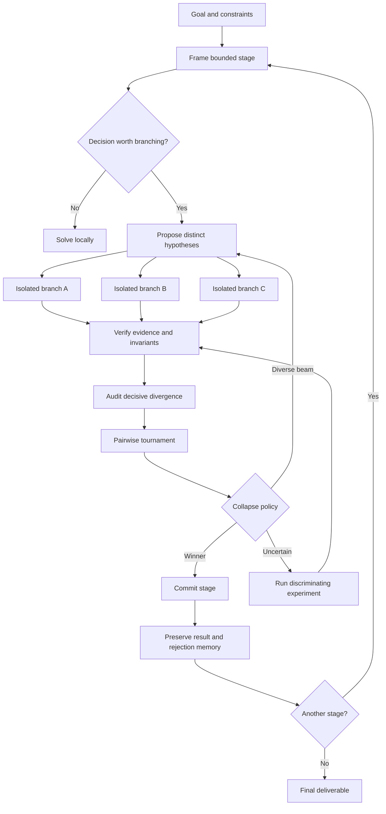

# Architecture

BranchForge separates reasoning from durable control-plane state.

The host model thinks, delegates, browses, writes code, and asks for approvals. BranchForge records structured state, validates lifecycle transitions, stores evidence and artifacts, and renders dossiers.

## Agent-Native Control Plane

The MCP server exposes deterministic tools for:

- creating and inspecting runs and stages;
- adding, starting, failing, pruning, verifying, and committing branches;
- recording claims, evidence, findings, and artifacts;
- rendering trees and dossiers;
- summarizing run status and next actions.

Every MCP tool accepts an optional `cwd`. State is stored under that project at `.branchforge/state.db`.

## Detailed Flow

## Core Concepts

### Branch

A branch is a falsifiable hypothesis, not a minor variation. It declares a claim, material difference, predictions, falsifiers, and risk.

### Verification

Hard invariants are checked before subjective judging. Tests, benchmarks, direct artifact inspection, primary sources, and deterministic validation outrank model confidence.

### Collapse

Candidates are compared at their decisive disagreements. The system may commit a winner, retain a diverse beam, synthesize compatible components, or ask for another experiment.

## Data Model

BranchForge persists:

- runs and stage specs;
- branch lineage and lifecycle status;
- claims and evidence;
- reusable findings;
- content-addressed artifacts;
- rendered decision records and branch dossiers.

## Artifacts And Dossiers

Artifacts are stored by SHA-256 under `.branchforge/objects`. Dossiers are rendered under `.branchforge/runs/<run_id>/` and include:

- `RUN.json`;
- `TREE.json`;
- `DECISION.md`;
- per-branch `HYPOTHESIS.md`, `OUTCOME.md`, `EVIDENCE.jsonl`, `ARTIFACTS.json`, and `MANIFEST.json`.

## Current Limitations

- Text proposals are evaluated primarily by model-based verification.
- Branches cannot yet create isolated runtime workspaces through the Python kernel.
- Runs cannot resume from the last committed event after process termination.
- Research citations and software test results are stored as typed evidence but are not yet independently executed by mode-specific evaluators.
- Duplicate detection is based on normalized titles.
- Provider adapters do not yet implement retries, streaming, rate-limit backoff, token accounting, or dollar budgets.
- Agent-native explorers share the host filesystem boundary until per-branch workspaces are implemented.
