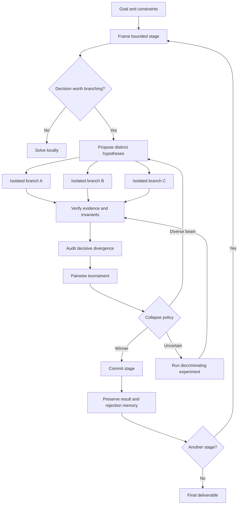

# Architecture

BranchForge separates reasoning from durable control-plane state.

The host model thinks, delegates, browses, writes code, and asks for approvals. BranchForge records structured state, validates lifecycle transitions, stores evidence and artifacts, and renders dossiers.

## Agent-Native Control Plane

The MCP server exposes deterministic tools for:

- creating and inspecting runs and stages;
- adding, starting, failing, pruning, verifying, and committing branches;
- recording claims, evidence, findings, and artifacts;
- rendering trees and dossiers;
- summarizing run status and next actions.

Every MCP tool accepts an optional `cwd`. State is stored under that project at `.branchforge/state.db`. The CLI reads the same file.

## Layers

| Module | Role |
|---|---|
| `store.py` | SQLite connection, the event log, and `atomic()`, one write transaction across several reads and writes |
| `repository.py` | Schema, migrations, and every lifecycle rule |
| `dossier.py` | Renders run and branch files from repository state |
| `native.py` | Agent-facing operations: input validation and compact responses |
| `mcp_server.py` | MCP tool schemas, descriptions, and annotations over `native.py` |
| `orchestrator.py` | Headless model loop, writing through the same repository rules |

The agent-native tools and the headless kernel both call `BranchRepository`. A rule placed there holds for both.

## Rules the code enforces

Skills describe the workflow. These rules do not depend on an agent following them.

- **A finished run cannot change.** Once a run is completed or failed, every write is refused. A run with no stages cannot complete.
- **Failing a run closes its branches.** Running branches become failed and the rest become pruned, each with the failure reason.
- **A stage commit is all or nothing.** Pruning the losers, committing the winner, recording the decision, and closing the stage happen in one transaction.
- **Admission has a budget.** A stage round admits at most `max_branches` branches, rounds stop at `max_rounds`, and two admitted branches in a round cannot share a title.
- **A failed check blocks verification.** The latest `check_record` result for each invariant decides. A verifier cannot mark a branch verified over a failed invariant check.
- **Only user-allowed commands are run.** The user lists named check commands, and the projects they apply to, in a JSON file outside those projects and points `BRANCHFORGE_CHECKS_FILE` at it. The `cwd` tool argument is honored for checks only when the file lists it. A stage references checks by name and cannot supply a command. `check_run` reads the command from that file at run time, runs it without a shell in the branch's directory, stores the log as an artifact, and records pass or fail from the exit code. For an invariant with a referenced check, a reported result is refused.
- **Observed stages need passing checks.** With `evidence_policy` `observed`, the default for software stages, a branch verifies only after a passing check for every invariant.
- **Scores follow the rubric.** `branch_verify` accepts a 0 to 1 score per rubric criterion and applies the stage weights itself.
- **References must exist.** Evidence, findings, and checks cannot cite a claim, evidence record, or artifact that is not in the run.

## Design basis

The selection rules follow published results on branching agents.

- **Executed checks decide, where they exist.** AIDE searches a tree of candidate solutions and scores each node by running it. Its authors report that on OpenAI's MLE-bench it won about four times the medals of the best linear agent. Anthropic's agent guidance says agents should take "ground truth from the environment at each step". Checks are therefore records of their own, and a failed one outranks any judgment.
- **The verifier is not the explorer.** Anthropic's long-running harness work found that agents asked to grade their own output praise it, and that a separate evaluator is easier to make skeptical. The evaluate skill asks for verification from a context that did not explore the branch. The code cannot yet tell who is calling.
- **Model votes are the weakest signal.** Studies of multi-agent debate find it does not reliably beat simpler baselines such as self-consistency. Pairwise votes are stored with the commit but never gate it.
- **Stopping conditions live in code.** The same Anthropic guidance recommends hard limits such as a maximum number of iterations, so admission budgets are enforced by the repository.
- **Isolation comes from the host.** Claude Code can run each subagent in its own git worktree. BranchForge records what a branch produced and leaves workspace isolation to the host.
- **Self-reported novelty is not enforced in agent hosts.** No result supports gating on a model's score of its own originality. Duplicate titles are rejected, and the headless kernel still applies `novelty_threshold`.

Sources: [Building effective agents](https://www.anthropic.com/engineering/building-effective-agents), [Harness design for long-running apps](https://www.anthropic.com/engineering/harness-design-long-running-apps), [How we built our multi-agent research system](https://www.anthropic.com/engineering/multi-agent-research-system), [AIDE](https://arxiv.org/abs/2502.13138), [Should we be going MAD?](https://arxiv.org/abs/2311.17371).

## Detailed Flow

```mermaid
flowchart TD
    G["Goal and constraints"] --> S["Frame bounded stage"]
    S --> D{"Decision worth branching?"}
    D -- "No" --> L["Solve locally"]
    D -- "Yes" --> P["Propose distinct hypotheses"]
    P --> B1["Isolated branch A"]
    P --> B2["Isolated branch B"]
    P --> B3["Isolated branch C"]
    B1 --> V["Verify evidence and invariants"]
    B2 --> V
    B3 --> V
    V --> A["Audit decisive divergence"]
    A --> J["Pairwise tournament"]
    J --> C{"Collapse policy"}
    C -->|"Winner"| K["Commit stage"]
    C -->|"Uncertain"| E["Run discriminating experiment"]
    C -->|"Diverse beam"| P
    E --> V
    K --> M["Preserve result and rejection memory"]
    M --> N{"Another stage?"}
    N -- "Yes" --> S
    N -- "No" --> O["Final deliverable"]
```

## Core Concepts

### Branch

A branch is a falsifiable hypothesis, not a minor variation. It declares a claim, material difference, predictions, falsifiers, and risk.

### Verification

Hard invariants are checked before subjective judging. Tests, benchmarks, direct artifact inspection, primary sources, and deterministic validation outrank model confidence.

### Collapse

Candidates are compared at their decisive disagreements. The system may commit a winner, retain a diverse beam, synthesize compatible components, or ask for another experiment.

## Data Model

BranchForge persists:

- runs and stage specs;
- branch lineage and lifecycle status;
- claims and evidence;
- checks, each a pass or fail with its command, exit code, invariant, and whether BranchForge ran it or a caller reported it;
- reusable findings;
- content-addressed artifacts;
- rendered decision records and branch dossiers.

## Artifacts And Dossiers

Artifacts are stored by SHA-256 under `.branchforge/objects`. Dossiers are rendered under `.branchforge/runs/<run_id>/` and include:

- `RUN.json`;
- `TREE.json`;
- `DECISION.md`;
- per-branch `HYPOTHESIS.md`, `OUTCOME.md`, `EVIDENCE.jsonl`, `CHECKS.json`, `ARTIFACTS.json`, and `MANIFEST.json`.

`DECISION.md` lists, for each committed stage, the winner's checks and every rejected alternative with its reason.

## Current Limitations

- Check execution is off by default. Without it the host runs the command and reports the outcome through `check_record`, so a check is only as honest as the agent recording it.
- `check_run` runs the command with the server's own permissions and environment, not in a sandbox. An allowed command such as a test runner executes code from the branch's directory, which the agent wrote. Allow only commands you would let the agent run anyway.
- The agent chooses the directory a check runs in, within the project and its worktrees. A check can therefore pass against a directory that does not hold the branch's work. Each executed check records its directory, and the dossier prints it, so a reviewer can tell.
- The check's output is stored as an artifact in the project. A command that prints secrets from the environment leaves them there.
- An agent with unrestricted shell access could edit the checks file itself. The file's protection is the host's permission prompt for writes outside the project.
- The headless kernel cannot execute anything, so its stages are always `judged`.
- The event log is an audit trail. State is not rebuilt from it.
- `survivor_width` and `novelty_threshold` bind the headless kernel only.
- Branches cannot yet create isolated runtime workspaces through the Python kernel.
- Runs cannot resume from the last committed event after process termination.
- Research citations and software test results are stored as typed evidence but are not yet independently executed by mode-specific evaluators.
- Duplicate detection is based on normalized titles.
- Provider adapters do not yet implement retries, streaming, rate-limit backoff, token accounting, or dollar budgets.
- Agent-native explorers share the host filesystem boundary until per-branch workspaces are implemented.
